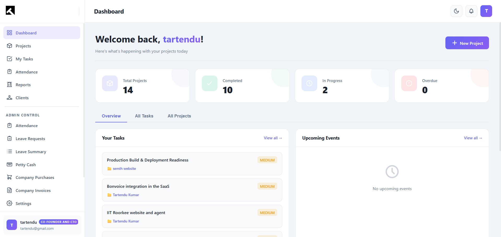
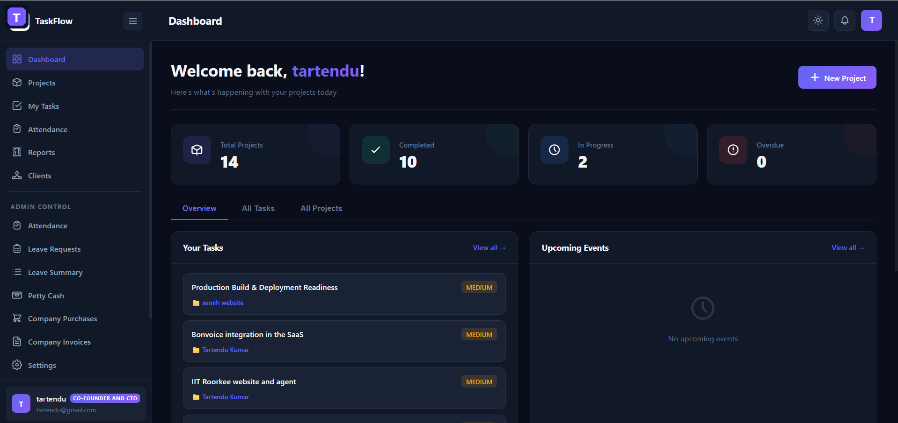

<div align="center">

# TaskFlow

### Open-source team, project & workforce management platform built with Flask + Firebase

Manage projects, tasks, attendance, leave, payroll-style petty cash, invoicing and clients — all in one self-hostable web app. TaskFlow combines a **Kanban project tracker**, an **HR & attendance system with facial recognition**, and an **expense/finance suite** behind a granular role-based permission model.

[](https://www.python.org/)
[](https://flask.palletsprojects.com/)
[](https://firebase.google.com/)
[](https://vercel.com/)
[](LICENSE)
[](#contributing)

[Features](#-features) · [Tech Stack](#-tech-stack) · [Quick Start](#-quick-start) · [Configuration](#-configuration) · [Deployment](#-deployment) · [Architecture](#-architecture) · [Roadmap](#-roadmap)

</div>

---

## 📸 Screenshots

<div align="center">
  
  <br><br>
  
  <br>
  <em>The TaskFlow dashboard in light and dark modes.</em>
</div>

## 📌 Overview

**TaskFlow** is an all-in-one operations platform for small teams, agencies, and studios. Instead of paying for separate tools for project management, time tracking, attendance, expenses, and client collaboration, TaskFlow brings them together in a single self-hosted application powered by **Flask** and **Google Firebase Firestore**.

It is designed around three audiences, each with their own portal:

- **Employees** — track tasks, log time, check in/out (with face recognition), request leave, and submit expenses.
- **Admins / Super-admins** — manage users, roles, projects, attendance, payroll-style petty cash, invoices, and company settings.
- **Clients** — log into a dedicated portal to follow project progress, view tasks, leave comments, and submit requirements.

> **Keywords:** project management software, Flask Firebase app, attendance system, facial recognition check-in, employee leave management, petty cash & expense tracker, invoicing app, Kanban task tracker, client portal, role-based access control, open-source HR tool.

## ✨ Features

### 🗂️ Project & Task Management
- Create and manage **projects** with members, status, and per-project dashboards
- **Task tracking** with assignees, priorities, due dates, comments, and a full **activity log**
- Personal **"My Tasks"** view aggregating work across projects
- **Requirements management** per project, with a client-side fulfillment workflow

### ⏱️ Time Tracking & Calendar
- Built-in **calendar** view of tasks and events
- **Time entries** logged against tasks for accurate effort tracking
- Custom **events** (create / edit / delete) and a dedicated time-management view

### 🧑‍💼 Attendance & HR
- One-click **check-in / check-out** with work-hour calculation
- **Facial-recognition attendance** powered by Azure Face API, including liveness **challenge**, enrollment, and verify-and-check-in
- **Automated daily auto-checkout** via scheduled cron for forgotten checkouts
- **Team attendance** overview, personal history, and attendance regularization requests
- **Leave management** — apply for leave, track leave balances, and admin approve/reject flows
- **Holiday calendar** management
- **Monthly attendance reports** with CSV export

### 💰 Finance & Expenses
- **Petty cash** funds with a running **ledger** and balance tracking
- **Expense** entry, editing, reimbursement, and approval/disbursement workflow
- 🤖 **AI receipt scanning** with Google Gemini — auto-extract amount, date, and vendor from uploaded receipts
- Custom **expense categories**, reports, and CSV export
- **Purchases** tracking with stats, file attachments, and export
- **Invoices** management with stats, file uploads, and export

### 👥 Clients & Collaboration
- Dedicated **client portal** with its own login, dashboard, and profile
- Clients view assigned **projects, tasks, time spent**, and leave **comments**
- Admins control **client → project access** and can reset client passwords

### 🔐 Access Control & Administration
- **Role-based permissions** with granular *view* vs *manage* control per module
- **Super-admin** bootstrap, plus accountant and custom roles
- **User management** — create, lock/unlock, assign roles, reset passwords
- **Admin impersonation** for troubleshooting user accounts
- Configurable **office settings** (hours, half-day thresholds) and **leave policies**
- **Billing / subscription** flow with checkout and payment pages
- In-app **notifications** with unread counts

## 🛠 Tech Stack

| Layer | Technology |
| --- | --- |
| **Backend** | Python 3.10+, Flask 3, Flask-Login |
| **Database** | Google Firebase Firestore (`firebase-admin`) |
| **Auth** | Flask-Login sessions; separate employee / admin / client login flows |
| **Scheduling** | APScheduler + Vercel Cron (daily auto-checkout) |
| **AI / ML** | Google Gemini (receipt OCR), Azure Face API (facial recognition) |
| **Frontend** | Jinja2 templates, vanilla JavaScript, modular CSS |
| **Hosting** | Vercel (serverless, see `vercel.json`) |

## 🚀 Quick Start

```bash
# 1. Clone
git clone https://github.com/tartendu/taskflow.git
cd taskflow

# 2. Create a virtual environment
python -m venv venv
# Windows
venv\Scripts\activate
# macOS / Linux
source venv/bin/activate

# 3. Install dependencies
pip install -r requirements.txt

# 4. Configure environment
cp .env.example .env        # fill in your values — see Configuration below

# 5. Run
python app.py               # http://localhost:5083
```

After registering your first user, set that user's email as `SUPER_ADMIN_EMAIL` in `.env` and restart — they'll be promoted to super-admin automatically.

## ⚙️ Configuration

All secrets are read from environment variables (loaded via `python-dotenv`). Copy [`.env.example`](.env.example) to `.env` and fill in:

- **Flask** — `SECRET_KEY`, `FLASK_ENV`, `SUPER_ADMIN_EMAIL`
- **Firebase Web** — API key, auth domain, project ID, etc.
- **Firebase Admin SDK** — service-account fields from your downloaded key JSON
- **Gemini** — `GEMINI_API_KEY` (optional, for receipt scanning)
- **Azure Face** — `AZURE_FACE_API_KEY`, `AZURE_FACE_ENDPOINT` (optional, for face attendance)
- **Cron** — `CRON_SECRET` (optional, protects the auto-checkout endpoint)

👉 **Step-by-step credential instructions are in [SETUP.md](SETUP.md).**

> ⚠️ **Never commit your `.env`.** It is excluded by `.gitignore`. If a key is ever exposed, rotate it immediately in the provider's console.

## ☁️ Deployment

TaskFlow ships with a `vercel.json` for serverless deployment on **Vercel**:

1. Import the repo into Vercel (or use the `vercel` CLI).
2. Add every variable from `.env` under **Project → Settings → Environment Variables**.
3. Deploy. The included **cron** triggers `/api/cron/auto-checkout` daily — keep `CRON_SECRET` set so the endpoint stays protected.

It also runs anywhere Flask runs (a VM, container, or PaaS) — point a WSGI server such as Gunicorn at `app:app`.

## 🧱 Architecture

TaskFlow uses Flask **blueprints** to keep each domain isolated, with a thin Firestore data-access layer.

```
app.py                  # App setup, blueprint registration, cron + auth/session config
firebase_config.py      # Firestore client + collection name constants
firebase_models.py      # Firestore models / data-access layer
helpers.py, models.py   # User/ClientUser models and shared helpers

# Feature blueprints
auth_routes.py          # Login, register, password
admin_routes.py         # Admin portal, users, billing, impersonation
superadmin_routes.py    # Super-admin: settings, leave approvals, reports
dashboard_routes.py     # Dashboards, profile, reports
project_routes.py       # Projects, tasks, comments, activities
requirements_routes.py  # Project requirements + client fulfillment
calendar_routes.py      # Calendar, events, time tracking
attendance_routes.py    # Attendance, leave, regularization
face_routes.py          # Facial-recognition enrollment & check-in
holiday_routes.py       # Holiday calendar
petty_cash_routes.py    # Petty cash, expenses, AI receipt scanning
purchases_routes.py     # Purchases
invoices_routes.py      # Invoices
client_routes.py        # Client portal + client management
notification_routes.py  # In-app notifications

templates/              # Jinja2 templates (admin / client / employee views)
static/                 # CSS, JS, images, face-api models
```

## 🗺 Roadmap

- [ ] REST API documentation (OpenAPI/Swagger)
- [ ] Automated test suite
- [ ] Docker / docker-compose for one-command local setup
- [ ] Email & push notifications
- [ ] Exportable analytics dashboards

## 🤝 Contributing

Contributions are welcome! To get started:

1. Fork the repo and create a feature branch.
2. Follow the setup in [SETUP.md](SETUP.md).
3. Make your changes with clear commit messages.
4. Open a pull request describing what and why.

Please **never** include real credentials, `.env` files, or service-account keys in a PR.

## 📄 License

This project is licensed under the **MIT License** — see the [LICENSE](LICENSE) file for details.

## 👤 Author

**Tartendu Kumar**

[](https://www.tartendu.in/)
[](https://github.com/tartendu/)
[](https://www.linkedin.com/in/tartendukumar/)
[](https://x.com/Tartendukumar)

- 🌐 Website — [tartendu.in](https://www.tartendu.in/)
- 💻 GitHub — [@tartendu](https://github.com/tartendu/)
- 💼 LinkedIn — [tartendukumar](https://www.linkedin.com/in/tartendukumar/)
- 🐦 X / Twitter — [@Tartendukumar](https://x.com/Tartendukumar)

---

<div align="center">

Built with Flask & Firebase by [**Tartendu Kumar**](https://www.tartendu.in/). ⭐ Star the repo if you find it useful!

</div>
